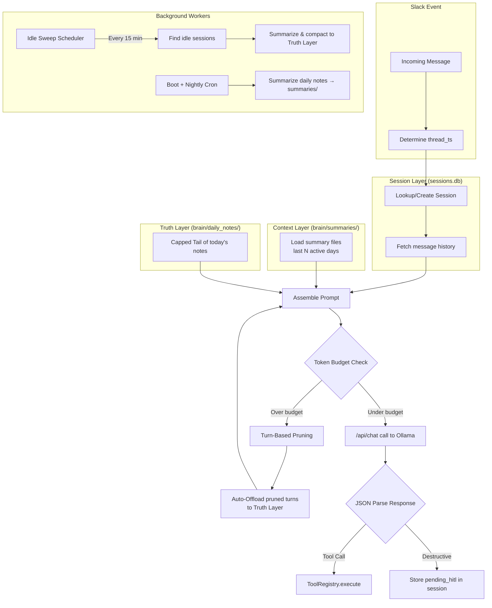

# Chat Memory Refactor — Sonnet Agent Implementation Plan

## Goal

Transform Grug from a **stateless single-turn router** into a **stateful multi-turn conversational agent** with a layered memory pyramid, persistent session tracking, automated summarization, and idle compaction — all while preserving the existing JSON-mode tool routing pattern and Slack Socket Mode connection.

## Source Specification

- [chat_memory_refactor.md](file:///Users/cj/work/llm/open-grug/build-plan/chat_memory_refactor.md) — The canonical architectural specification.
- [Previous audit](file:///Users/cj/.gemini/antigravity/brain/c1f50988-39f0-4a05-8df4-fc5a141541ac/chat_memory_refactor_audit.md) — All audit findings have been incorporated into the final spec.

---

## Architecture Overview



---

## Wave Structure

Tasks are organized into **4 waves** based on dependency order. All tasks within a wave can be executed **in parallel** by separate Sonnet agents. A wave must complete before the next wave begins.

| Wave | Tasks | Theme |
|------|-------|-------|
| **Wave 1** | T1, T2, T3 | Foundation — zero-dependency new modules |
| **Wave 2** | T4, T5, T6 | Core Engine — orchestrator rewrite, summarizer, storage upgrade |
| **Wave 3** | T7, T8, T9 | Integration — app.py rewrite (incl. HITL), prompts, docs |
| **Wave 4** | T10, T11 | Finalization — tests, Docker/deps |

---

## Wave 1 — Foundation (Parallel)

These three tasks have **no dependencies** on each other or on modified existing files. They produce new standalone modules.

---

### T1: Create `core/config.py` — Configuration Loader

**Purpose:** Externalize all memory/LLM tuning parameters into `grug_config.json` with a Python loader class.

#### Files

| Action | File |
|--------|------|
| **CREATE** | [grug_config.json](file:///Users/cj/work/llm/open-grug/grug_config.json) |
| **CREATE** | [core/config.py](file:///Users/cj/work/llm/open-grug/core/config.py) |

#### Specification

**`grug_config.json`** — Create the file at project root with these exact contents:
```json
{
  "llm": {
    "model_name": "gemma:2b",
    "max_context_tokens": 8192,
    "target_context_tokens": 2048,
    "temperature": 0.1
  },
  "memory": {
    "summary_days_limit": 7,
    "summary_token_budget": 300,
    "summarization_threshold_bytes": 100,
    "thread_history_limit": 10,
    "thread_idle_timeout_hours": 4,
    "idle_sweep_interval_minutes": 15,
    "capped_tail_lines": 100,
    "rag_result_limit": 3
  },
  "storage": {
    "base_dir": "./brain",
    "session_ttl_days": 30
  }
}
```

**`core/config.py`** — Implement:
```python
class GrugConfig:
    """Loads grug_config.json with defaults for every key.
    
    - Constructor accepts an optional `config_path` argument (default: auto-detect).
    - Auto-detection: check `./grug_config.json`, then `/app/grug_config.json` (Docker).
    - If the file doesn't exist, use built-in defaults silently (no crash).
    - Expose attributes via dot notation: `config.llm.model_name`, `config.memory.summary_days_limit`, etc.
    - Use nested dataclasses or SimpleNamespace for the sub-objects.
    - The `storage.base_dir` should respect the `DOCKER` env var: if `DOCKER` is set, override to `/app/brain`.
    """
```

- All defaults must match the JSON above exactly.
- Include a module-level singleton: `config = GrugConfig()` so other modules can do `from core.config import config`.

#### Acceptance Criteria
- [x] `from core.config import config` works.
- [x] `config.llm.model_name` returns `"gemma:2b"`.
- [x] `config.memory.thread_idle_timeout_hours` returns `4`.
- [x] Missing file → defaults silently used, no exception.
- [x] `config.storage.base_dir` returns `/app/brain` when `DOCKER` env var is set.

---

### T2: Create `core/sessions.py` — Session Store

**Purpose:** SQLite-backed CRUD for Slack thread conversation sessions, stored in a **dedicated `sessions.db`** (separate from `memory.db`).

#### Files

| Action | File |
|--------|------|
| **CREATE** | [core/sessions.py](file:///Users/cj/work/llm/open-grug/core/sessions.py) |

#### Specification

**DDL** (execute on init):
```sql
CREATE TABLE IF NOT EXISTS sessions (
    thread_ts   TEXT PRIMARY KEY,
    channel_id  TEXT NOT NULL,
    messages    TEXT NOT NULL DEFAULT '[]',      -- JSON array of message objects
    pending_hitl TEXT DEFAULT NULL,              -- JSON object or null
    last_active TIMESTAMP NOT NULL DEFAULT CURRENT_TIMESTAMP
);
CREATE INDEX IF NOT EXISTS idx_sessions_last_active ON sessions(last_active);
```

**Class: `SessionStore`**
```python
class SessionStore:
    def __init__(self, db_path: str):
        """
        - Open SQLite connection with check_same_thread=False (accessed from handler threads + sweep thread).
        - Execute DDL above.
        - Store db_path for reference.
        """

    def get_or_create(self, thread_ts: str, channel_id: str) -> dict:
        """
        Fetch session by thread_ts. If not found, INSERT a new row with empty messages '[]'.
        Always UPDATE last_active = CURRENT_TIMESTAMP on access.
        Returns: {"thread_ts": str, "channel_id": str, "messages": list[dict], "pending_hitl": dict|None}
        - Deserialize `messages` from JSON string to Python list.
        - Deserialize `pending_hitl` from JSON string to Python dict or None.
        """

    def update_messages(self, thread_ts: str, messages: list[dict]):
        """
        Serialize `messages` to JSON string. UPDATE the row. UPDATE last_active.
        """

    def set_pending_hitl(self, thread_ts: str, hitl_data: dict | None):
        """
        Serialize `hitl_data` to JSON string (or NULL). UPDATE the row.
        Do NOT update last_active (HITL state is system state, not user activity).
        """

    def get_idle_sessions(self, idle_hours: float) -> list[dict]:
        """
        SELECT all sessions WHERE last_active < (now - idle_hours).
        Return full session dicts (same shape as get_or_create).
        """

    def delete_session(self, thread_ts: str):
        """DELETE the row."""

    def check_last_active(self, thread_ts: str) -> str | None:
        """
        Return the current last_active timestamp for the given thread_ts,
        or None if the row doesn't exist. Used for optimistic concurrency check
        before deleting idle sessions.
        """
```

#### Key Constraints
- All methods must be safe to call from multiple threads (SQLite serialized mode + `check_same_thread=False`).
- The `db_path` should default to `./brain/sessions.db` (or `/app/brain/sessions.db` for Docker) — but the caller will pass this explicitly.
- Do NOT import `core.config` — this module should be a pure data layer with no config dependency. Config values are passed in by the caller.

#### Acceptance Criteria
- [x] Creates `sessions.db` with the correct schema.
- [x] `get_or_create` for a new thread_ts creates a row and returns it.
- [x] `get_or_create` for an existing thread_ts returns the existing row with updated `last_active`.
- [x] `update_messages` round-trips a list of `{"role": "user", "content": "..."}` dicts.
- [x] `set_pending_hitl` stores and retrieves a JSON object, and can be set to `None`.
- [x] `get_idle_sessions` correctly filters by elapsed time.
- [x] `delete_session` removes the row.
- [x] `check_last_active` returns timestamp string or None.

---

### T3: Create `brain/summaries/` Directory + Summaries File Convention

**Purpose:** Ensure the summaries directory exists and document the naming convention.

#### Files

| Action | File |
|--------|------|
| **CREATE** | `brain/summaries/.gitkeep` |

#### Specification

- Create `brain/summaries/` directory with a `.gitkeep` file.
- Summary files follow the naming convention: `brain/summaries/YYYY-MM-DD.summary.md`.
- This is a trivial task — it can be bundled with T1 or T2 if wave parallelism is not needed.

#### Acceptance Criteria
- [x] `brain/summaries/` directory exists.
- [x] `.gitkeep` file present so git tracks the empty directory.

---

## Wave 2 — Core Engine (Parallel, depends on Wave 1)

These tasks modify or create the core business logic modules. They depend on T1 (config) and T2 (sessions) but are independent of each other.

---

### T4: Upgrade `core/storage.py` — Thread-Safe Append + Capped Tail

**Purpose:** Make `append_log()` thread-safe and add a `get_capped_tail()` method for reading the bottom N lines of today's daily notes.

#### Files

| Action | File |
|--------|------|
| **MODIFY** | [core/storage.py](file:///Users/cj/work/llm/open-grug/core/storage.py) |

#### Specification

**Changes to existing code:**

1. **Add `threading.Lock`** — Create a module-level or instance-level lock. Wrap `append_log()` file write in `with self._write_lock:`.

2. **Add `get_capped_tail()` method:**
```python
def get_capped_tail(self, max_lines: int = 100) -> str:
    """
    Read the LAST `max_lines` lines from today's daily note file.
    Returns the lines joined as a string, or empty string if no file exists.
    This is used for the "Capped Tail" context injection (§5.1 step 3).
    """
```

3. **Add `get_daily_file_for_date()` helper** — Accept a `date_str: str` parameter (YYYY-MM-DD format) to allow the summarizer to read specific days' files.

4. **Add `append_log_with_source()` method** (or modify `append_log` signature):
```python
def append_log(self, source: str, text: str):
    """
    Append a bullet to today's log. Thread-safe.
    Format: `- HH:MM:SS [source] text\n`
    The `source` parameter replaces the old `tool_name` parameter.
    """
```

> [!IMPORTANT]
> The method signature change from `tool_name` to `source` is cosmetic — they serve the same purpose. The existing call sites (`add_note` uses `"note"` as the source) must continue to work. Make sure the parameter rename doesn't break the `add_note` method's internal call to `append_log`.

**Preserve all existing methods and comments.** Only add the lock, the new methods, and update the `append_log` signature.

#### Acceptance Criteria
- [x] `append_log()` is wrapped in a `threading.Lock()`.
- [x] `get_capped_tail(50)` returns at most 50 lines from today's file.
- [x] `get_capped_tail()` returns `""` if today's file doesn't exist.
- [x] `add_note()` still works identically.
- [x] `get_recent_notes()` still works identically.

---

### T5: Create `core/summarizer.py` — Summarization Engine

**Purpose:** Implement three distinct summarization operations: daily FIFO, prune auto-offload, and idle session compaction.

#### Files

| Action | File |
|--------|------|
| **CREATE** | [core/summarizer.py](file:///Users/cj/work/llm/open-grug/core/summarizer.py) |

#### Specification

Imports allowed: `core.config.config`, `core.storage.GrugStorage`. Does NOT import `core.sessions` (session data is passed in as arguments).

```python
class Summarizer:
    def __init__(self, storage: GrugStorage, ollama_host: str, model_name: str):
        """
        - Store references to storage, ollama_host, model_name.
        - These are passed in by the caller, not read from config directly
          (to allow test injection).
        """

    def _call_llm_text(self, prompt: str) -> str:
        """
        Make a POST to {ollama_host}/api/generate with:
          model=model_name, prompt=prompt, stream=False
        NO format="json" — this is plain-text summarization.
        Return the response text, or "" on error.
        Timeout: 60 seconds (summarization can be slow).
        """

    def summarize_daily_notes(self, summaries_dir: str, daily_notes_dir: str,
                               threshold_bytes: int, days_limit: int):
        """
        Boot + nightly cron entry point.
        
        1. List all YYYY-MM-DD.md files in daily_notes_dir.
        2. For each file:
           a. If size < threshold_bytes, skip.
           b. If summaries_dir/YYYY-MM-DD.summary.md already exists, skip.
           c. Read the file content.
           d. Prompt: "Summarize these logs into high-density professional bullets.
              No caveman voice. Be concise and factual. Output ONLY bullet points."
           e. Write result to summaries_dir/YYYY-MM-DD.summary.md
        3. Prune: list all .summary.md files sorted by date descending.
           Delete any beyond days_limit (keep only the newest N).
        """

    def summarize_pruned_turns(self, turns_text: str) -> str:
        """
        Auto-offload entry point (called during context pruning).
        
        Prompt: "Summarize the key facts from this conversation excerpt.
                 Output ONLY a single concise bullet point suitable for a log entry.
                 No caveman voice. Be factual."
        
        Returns: the summary string (caller will format it as a bullet and
                 append to daily notes via storage.append_log).
        Returns "" on LLM failure (caller handles graceful degradation).
        """

    def summarize_session_for_compaction(self, messages: list[dict]) -> str:
        """
        Idle compaction entry point.
        
        Convert messages list to readable transcript, then prompt:
        "Summarize this Slack conversation into high-density professional bullets.
         No caveman voice. Output ONLY bullet points, each starting with '- '."
        
        Returns: the summary string (caller formats and appends to daily notes).
        Returns "" on LLM failure.
        """
```

#### Key Constraints
- All LLM calls use `/api/generate` (plain text mode, NOT `/api/chat`) — these are one-shot summarization prompts, not conversations.
- The `summarize_daily_notes` method is idempotent — re-running it skips days that already have summaries.
- The prune step in `summarize_daily_notes` deletes the oldest summary files to maintain exactly `days_limit` files.

#### Acceptance Criteria
- [x] `summarize_daily_notes` creates `.summary.md` files in the summaries directory.
- [x] `summarize_daily_notes` skips files below threshold.
- [x] `summarize_daily_notes` skips files that already have summaries.
- [x] `summarize_daily_notes` prunes old summaries beyond `days_limit`.
- [x] `summarize_pruned_turns` returns a string or `""`.
- [x] `summarize_session_for_compaction` returns a string or `""`.
- [x] All methods handle LLM errors gracefully (no exceptions leak out).

---

### T6: Rewrite `core/orchestrator.py` — Migrate to `/api/chat`

**Purpose:** Rewrite `GrugRouter` to use the Ollama `/api/chat` endpoint with multi-turn message history, while preserving JSON-mode tool routing.

#### Files

| Action | File |
|--------|------|
| **MODIFY** | [core/orchestrator.py](file:///Users/cj/work/llm/open-grug/core/orchestrator.py) |

#### Specification

> [!IMPORTANT]
> **Preserve the entire `ToolRegistry` class unchanged.** It is not affected by this refactor. Only `GrugRouter` changes.

**Changes to `GrugRouter`:**

1. **New `route_message` signature:**
```python
def route_message(self, user_message: str, system_prompt: str, 
                  message_history: list[dict]) -> ToolExecutionResult:
    """
    - system_prompt: fully assembled system prompt (persona + summaries + capped tail).
      The caller (app.py) now builds this, not the router.
    - message_history: list of {"role": "user"|"assistant", "content": "..."} dicts
      from the session store, PLUS the new user_message appended.
    """
```

2. **Replace `invoke_gemma()` with `invoke_chat()`:**
```python
def invoke_chat(self, system_prompt: str, messages: list[dict]) -> str:
    """
    POST to {ollama_host}/api/chat with:
      model=model_name,
      messages=[{"role": "system", "content": system_prompt}] + messages,
      format="json",
      stream=False
    
    Return: response.json()["message"]["content"]
    Fallback on error: return escalate_to_frontier JSON string.
    Timeout: 30 seconds.
    """
```

3. **Keep `invoke_gemma_text()` for non-JSON calls** (used by `execute_summarize_board`). Rename to `invoke_text()` for clarity but keep the same logic.

4. **Remove the old monolithic prompt assembly** from `route_message`. The caller now passes in `system_prompt` and `message_history` fully formed. The router's job is just:
   - Call `invoke_chat()` with the system prompt and messages.
   - Parse the JSON response.
   - Execute via `ToolRegistry`.
   - Handle confidence score escalation (preserve existing logic).
   - Handle graceful degradation (preserve existing logic).

5. **Remove `build_system_prompt()` from the router** — this responsibility moves to `app.py` where the context injection pipeline lives.

6. **Keep `_request_state` for frontier escalation** — the escalation flow still needs the user message and context for the Claude API call.

7. **Keep all `register_core_tools()` and tool execution methods unchanged.**

8. **Preserve `load_prompt_files()` as a module-level function** — it's still used by the caller.

#### What NOT to change
- `ToolRegistry` class — zero modifications.
- `ToolExecutionResult` model — zero modifications.
- `load_prompt_files()` function — zero modifications.
- `_sanitize_untrusted()` function — zero modifications.
- All `execute_*` methods on `GrugRouter` — zero modifications.

#### Acceptance Criteria
- [x] `route_message` accepts `system_prompt` and `message_history` parameters.
- [x] `invoke_chat` POSTs to `/api/chat` with `messages` array format.
- [x] JSON-mode routing still works (parse response as JSON, extract `tool`/`arguments`).
- [x] Confidence score escalation logic preserved.
- [x] Graceful degradation logic preserved.
- [x] `ToolRegistry` completely unchanged.

---

## Wave 3 — Integration (Parallel, depends on Wave 2)

These tasks integrate the new modules into the application entry point and update documentation.

---

### T7: Rewrite `app.py` — Context Injection Pipeline + Background Workers

**Purpose:** Rewrite the Slack event handlers to use the session store, build the multi-turn context pipeline, and start background workers.

#### Files

| Action | File |
|--------|------|
| **MODIFY** | [app.py](file:///Users/cj/work/llm/open-grug/app.py) |

#### Specification

This is the **largest and most complex task**. The agent implementing this task MUST read `chat_memory_refactor.md` §5.1 (Context Injection Pipeline) thoroughly.

**New imports:**
```python
from core.config import config
from core.sessions import SessionStore
from core.summarizer import Summarizer
import threading
```

**Initialization changes:**
```python
# Replace hardcoded paths with config
storage = GrugStorage(base_dir=config.storage.base_dir)
session_store = SessionStore(
    db_path=os.path.join(config.storage.base_dir, "sessions.db")
)
summarizer = Summarizer(
    storage=storage,
    ollama_host=os.environ.get("OLLAMA_HOST", "http://localhost:11434"),
    model_name=config.llm.model_name
)
```

**Rewrite `handle_message` — Context Injection Pipeline (§5.1):**

```
Step 1 — Identity:
  thread_ts = event.get('thread_ts', event['ts'])
  channel_id = event.get('channel')

Step 2 — Recall:
  session = session_store.get_or_create(thread_ts, channel_id)
  history = session["messages"][-config.memory.thread_history_limit:]

Step 3 — Environment:
  summaries = load_summary_files(
      os.path.join(config.storage.base_dir, "summaries"),
      config.memory.summary_days_limit
  )
  capped_tail = storage.get_capped_tail(config.memory.capped_tail_lines)

Step 4 — Assemble:
  system_prompt = build_system_prompt(base_prompt, summaries, capped_tail)
  messages = history + [{"role": "user", "content": text}]

Step 5 — Safety Check & Auto-Offload:
  estimated_tokens = len(str(system_prompt) + str(messages)) // 4
  while estimated_tokens > config.llm.target_context_tokens and len(messages) > 1:
      # Find the first complete Turn (everything up to the next "user" role message)
      turn_end = find_turn_boundary(messages)
      pruned = messages[:turn_end]
      messages = messages[turn_end:]
      # Auto-offload in background
      threading.Thread(
          target=_auto_offload_pruned_turns,
          args=(pruned, summarizer, storage),
          daemon=True
      ).start()
      estimated_tokens = len(str(system_prompt) + str(messages)) // 4

Step 6 — Route:
  result = router.route_message(text, system_prompt, messages)

Step 7 — Persist:
  new_messages = history + [
      {"role": "user", "content": text},
      {"role": "assistant", "content": result.output}
  ]
  session_store.update_messages(thread_ts, new_messages)
```

**Helper functions to implement in `app.py`:**

```python
def load_summary_files(summaries_dir: str, days_limit: int) -> str:
    """
    Read up to `days_limit` .summary.md files from summaries_dir,
    sorted by date descending. Return their concatenated content.
    """

def build_system_prompt(base_prompt: str, summaries: str, capped_tail: str) -> str:
    """
    Assemble: persona prompt + summaries block + today's capped tail.
    Include the COMPRESSION_MODE and CURRENT_DATE interpolation.
    """

def find_turn_boundary(messages: list[dict]) -> int:
    """
    Find the index of the end of the first complete Turn.
    A Turn boundary is defined by the NEXT user message after position 0.
    Everything from index 0 to that boundary is one atomic Turn.
    Returns the index (exclusive) to slice at.
    If no second user message found, return len(messages) - 1
    (keep at least the last message).
    """

def _auto_offload_pruned_turns(pruned: list[dict], summarizer, storage):
    """
    Background thread: summarize pruned turns and append to today's daily notes.
    Uses storage.append_log("auto-offload", summary_text).
    """
```

**Background Workers (add to `__main__` block):**

```python
def _idle_sweep_loop(session_store, summarizer, storage, config):
    """
    Simple sleep-loop daemon thread. Runs every config.memory.idle_sweep_interval_minutes.
    
    while True:
        time.sleep(config.memory.idle_sweep_interval_minutes * 60)
        1. Fetch idle sessions via session_store.get_idle_sessions(config.memory.thread_idle_timeout_hours).
        2. For each idle session:
           a. Record the current last_active timestamp.
           b. Summarize messages via summarizer.summarize_session_for_compaction().
           c. Append summary to daily notes via storage.append_log("idle-compaction", ...).
           d. OPTIMISTIC CHECK: re-read last_active via session_store.check_last_active().
              If it changed since step (a), ABORT deletion (user sent a message during compaction).
           e. If unchanged, session_store.delete_session(thread_ts).
    """

def _nightly_summarize_loop(summarizer, config):
    """
    Simple sleep-loop daemon thread for nightly summarization.
    Checks every 60 seconds if the hour is 0 (midnight) and a flag
    `_summarized_today` hasn't been set. Runs summarize_daily_notes once
    per night, then sleeps until the next day.
    """

def _boot_summarize(summarizer, config):
    """Run summarize_daily_notes on startup."""
```

Add to `__main__`:
```python
# Boot summarization
threading.Thread(target=_boot_summarize, args=(summarizer, config), daemon=True).start()

# Idle sweep — simple sleep loop
threading.Thread(target=_idle_sweep_loop, 
                 args=(session_store, summarizer, storage, config), 
                 daemon=True).start()

# Nightly summarization — simple sleep loop checking for midnight
threading.Thread(target=_nightly_summarize_loop,
                 args=(summarizer, config),
                 daemon=True).start()
```

**LLM call must not block Slack event loop:**
Wrap the entire post-Step-1 pipeline in a background thread so Grug remains responsive. The thinking emoji (`thought_balloon`) is added before spawning the thread and removed after.

**Remove the `PENDING` dictionary** — HITL state moves to `sessions.db` (see HITL section below).

**HITL Persistence (merged into this task):**

Migrate HITL approval state from the volatile `PENDING` dict to the `pending_hitl` column in `sessions.db`.

**When the router returns `requires_approval=True`:**
```python
# Store in session
session_store.set_pending_hitl(thread_ts, {
    "tool_name": result.tool_name,
    "arguments": result.arguments,
    "user": event.get("user"),
})
# Post approval buttons (same Block Kit as current code)
# Use thread_ts in the button value so the handler can look up the session
```

**`handle_approve` rewrite:**
```python
@app.action("grug_approve")
def handle_approve(ack, body, client):
    ack()
    # Extract thread_ts from button value
    thread_ts = body["actions"][0]["value"]
    channel = body["channel"]["id"]
    clicker = body["user"]["id"]
    
    session = session_store.get_or_create(thread_ts, channel)
    pending = session["pending_hitl"]
    
    if not pending:
        client.chat_postMessage(channel=channel, text="No pending action found.")
        return
    
    if clicker != pending["user"]:
        client.chat_postEphemeral(channel=channel, user=clicker,
            text=":no_entry_sign: Only the requester can approve.")
        return
    
    # Execute the tool
    result = registry.execute(pending["tool_name"], pending["arguments"], skip_hitl=True)
    
    # Clear pending state
    session_store.set_pending_hitl(thread_ts, None)
    
    # Append tool result to session messages
    messages = session["messages"]
    messages.append({"role": "assistant", "content": f"[Tool executed: {pending['tool_name']}] {result.output}"})
    session_store.update_messages(thread_ts, messages)
    
    # Re-trigger inference so Grug can react to the tool output
    # (rebuild system prompt, call router.route_message with updated history)
    # Post Grug's follow-up response to the thread
    
    client.chat_postMessage(channel=channel, thread_ts=thread_ts,
        text=f"<@{clicker}> approved `{pending['tool_name']}`: {result.output}")
```

**`handle_deny` rewrite:** Similar pattern — clear `pending_hitl`, post denial message.

**Key change:** Button `value` now contains `thread_ts` (not a UUID), since the session row IS the lookup key.

#### Acceptance Criteria
- [x] Messages in a Slack thread maintain conversation history across turns.
- [x] System prompt includes summaries + capped tail of today's notes.
- [x] Turn-based pruning correctly identifies atomic turn boundaries.
- [x] Auto-offload fires in a background thread for pruned turns.
- [x] Idle sweep runs on a configurable interval via simple sleep loop.
- [x] Nightly summarization runs via simple sleep loop checking for midnight.
- [x] Idle sweep performs optimistic `last_active` check before deletion.
- [x] Boot summarization runs on startup.
- [x] LLM inference doesn't block the Slack event loop.
- [x] HITL state survives container restarts (stored in SQLite, not in-memory dict).
- [x] Approval executes the tool and re-triggers LLM inference.
- [x] Tool result is appended to session message history.
- [x] Deny clears the pending state.
- [x] Wrong-user approval is still rejected with ephemeral message.
- [x] `PENDING` dict and `_sweep_pending()` are completely removed.

---

### T8: Update System Prompt for Multi-Turn + RAG Nudge

**Purpose:** Update the prompt files to work with the new `/api/chat` multi-turn format and add the RAG nudge.

#### Files

| Action | File |
|--------|------|
| **MODIFY** | [prompts/system.md](file:///Users/cj/work/llm/open-grug/prompts/system.md) |

#### Specification

**Add to system.md after the existing persona section:**

```markdown
## Memory Context
The following summaries and notes are your recent memory. Use them to maintain continuity.

CRITICAL: If the user refers to an event, task, or conversation from earlier today or a past day that is NOT visible in your logs above, you MUST use the `query_memory` tool to search your memory database before replying. Do not guess.
```

**Update the JSON output instruction:**
The system prompt currently says "You ONLY output valid JSON representing tool calls." This remains correct for `/api/chat` — the model's response in the `assistant` message should still be a JSON tool-call object. No change needed here.

**Ensure `{{COMPRESSION_MODE}}` and `{{CURRENT_DATE}}` placeholders are preserved.**

#### Acceptance Criteria
- [x] System prompt includes the RAG nudge with CRITICAL emphasis.
- [x] `{{COMPRESSION_MODE}}` and `{{CURRENT_DATE}}` placeholders intact.
- [x] Prompt still instructs JSON-only output.

---

### T9: Update `ai-context.md`

**Purpose:** Resolve the documented architectural contradiction where `ai-context.md` says "never write raw SQL for state tracking" — which now conflicts with the `sessions` table.

#### Files

| Action | File |
|--------|------|
| **MODIFY** | [ai-context.md](file:///Users/cj/work/llm/open-grug/ai-context.md) |

#### Specification

**Replace rule #1 in "Core Rules for Building & Debugging":**

Old:
> Never write raw SQL for state tracking. Everything MUST be appended to the Markdown files in `core/storage.py`. The SQL vector-store is strictly a volatile cache.

New:
> **SQLite is used for two purposes:** (1) The volatile VSS vector cache in `memory.db` — a searchable index over the Truth Layer that can be deleted and rebuilt by re-indexing daily notes. (2) Ephemeral session state in `sessions.db` — tracks active Slack thread conversation history and pending HITL actions. Both databases are ephemeral — all substantive data is always persisted to the Truth Layer (Markdown files in `brain/daily_notes/`) before session deletion. The Truth Layer remains the canonical, permanent source of all data.

**Update "Core File Structure" section to add:**
```
- `core/sessions.py`: SessionStore class (SQLite CRUD for `sessions.db`).
- `core/summarizer.py`: Summarization engine (daily FIFO, idle compaction, prune auto-offload).
- `core/config.py`: Configuration loader (reads `grug_config.json`).
- `grug_config.json`: Externalized memory and LLM tuning parameters.
```

#### Acceptance Criteria
- [x] No contradiction between `ai-context.md` and the use of SQLite for session state.
- [x] Core File Structure reflects all new modules.
- [x] All other existing rules (CLI sandboxing, caveman mode, environment) preserved.

---

## Wave 4 — Finalization (Parallel, depends on Wave 3)

---

### T10: Rewrite Test Suite

**Purpose:** Update `test_grug.py` to test the new architecture: session store, context pipeline, HITL persistence, and summarizer.

#### Files

| Action | File |
|--------|------|
| **MODIFY** | [test_grug.py](file:///Users/cj/work/llm/open-grug/test_grug.py) |

#### Specification

**Preserve the existing test structure** (numbered functions, `run_tests()` runner). Add new tests and update broken ones.

**Tests to UPDATE (signature changes):**
- `test_1`: `route_message` now takes `system_prompt` and `message_history` instead of `context`.
- `test_2`: Same signature change.
- `test_4`: Same signature change.
- `test_7` through `test_10`: HITL tests must use `SessionStore` instead of `PENDING` dict.

**New tests to ADD:**

```
test_16_session_store_crud:
  - Create SessionStore with temp DB path.
  - get_or_create for new thread → verify empty messages.
  - update_messages → verify round-trip.
  - set_pending_hitl → verify round-trip.
  - delete_session → verify gone.

test_17_session_store_idle_detection:
  - Create session with backdated last_active.
  - get_idle_sessions(1) → verify it's returned.

test_18_config_loader_defaults:
  - GrugConfig with no file → verify defaults match spec.

test_19_config_loader_file:
  - Write a temp grug_config.json with overridden values.
  - Verify config loads them.

test_20_capped_tail_limits_output:
  - Write 200 lines to a daily note.
  - get_capped_tail(50) → verify exactly 50 lines.

test_21_thread_safe_append:
  - Spawn 10 threads each calling append_log 10 times.
  - Verify file has exactly 100 lines, no corruption.

test_22_turn_boundary_detection:
  - Build a messages list with user/assistant/tool interleaving.
  - Verify find_turn_boundary returns correct index.

test_23_hitl_persists_across_restart:
  - Store pending_hitl in session.
  - Create new SessionStore instance (simulating restart).
  - Verify pending_hitl is still there.
```

#### Acceptance Criteria
- [x] All existing tests updated to match new API signatures.
- [x] New tests cover session store, config, capped tail, thread safety, turn boundaries.
- [x] `python test_grug.py` passes all tests.

---

### T11: Update Dependencies + Dockerfile

**Purpose:** Update dependencies in `requirements.txt` and ensure the Dockerfile handles the new files/directories.

#### Files

| Action | File |
|--------|------|
| **MODIFY** | [requirements.txt](file:///Users/cj/work/llm/open-grug/requirements.txt) |
| **MODIFY** | [Dockerfile](file:///Users/cj/work/llm/open-grug/Dockerfile) |
| **MODIFY** | [docker-compose.yml](file:///Users/cj/work/llm/open-grug/docker-compose.yml) |
| **MODIFY** | [.gitignore](file:///Users/cj/work/llm/open-grug/.gitignore) |

#### Specification

**`requirements.txt`** — No new dependencies needed (sleep loops use stdlib `time` and `threading`).
Remove `fastapi` and `uvicorn` — they are not used in the current codebase and the refactor stays on Socket Mode.

**`Dockerfile`** — Add:
```dockerfile
RUN mkdir -p /app/brain/summaries
```
(after the existing `RUN mkdir -p /app/brain/daily_notes`)

**`docker-compose.yml`** — No structural changes needed. The `./brain:/app/brain` volume mount already covers `brain/summaries/` and `brain/sessions.db`.

**`.gitignore`** — Add:
```
brain/sessions.db
brain/summaries/*.summary.md
```

#### Acceptance Criteria
- [x] `pip install -r requirements.txt` succeeds.
- [x] `docker build .` succeeds.
- [x] `brain/summaries/` directory created in Docker.
- [x] `sessions.db` and summary files are gitignored.

---

## Cross-Reference Verification

The following table maps every section of `chat_memory_refactor.md` to the task(s) that implement it:

| Refactor Spec Section | Task(s) | Status |
|----------------------|---------|--------|
| §1 Memory Pyramid — Truth Layer | T4 (thread-safe storage) | ✅ Covered |
| §1 Memory Pyramid — Context Layer | T5 (summarizer), T7 (load summaries) | ✅ Covered |
| §1 Memory Pyramid — Session Layer | T2 (session store), T7 (integration) | ✅ Covered |
| §1 Memory Pyramid — Search Layer | No change needed (vectors.py untouched) | ✅ Covered |
| §1 Database Separation Rationale | T2 (separate sessions.db) | ✅ Covered |
| §2 Configuration | T1 (config loader + JSON file) | ✅ Covered |
| §3 Schema DDL | T2 (session store DDL) | ✅ Covered |
| §4.1 `/api/chat` Migration | T6 (orchestrator rewrite) | ✅ Covered |
| §4.2 High-Density FIFO | T5 (summarize_daily_notes) | ✅ Covered |
| §4.3 Auto-Offloading | T7 (prune offload in pipeline) | ✅ Covered |
| §4.3 Idle Compaction | T7 (idle sweep loop) | ✅ Covered |
| §4.3 Race Condition Mitigation | T7 (optimistic check) + T2 (check_last_active) | ✅ Covered |
| §4.3 Missing Session Handling | T2 (get_or_create) | ✅ Covered |
| §5.1 Context Injection Pipeline | T7 (full pipeline in handle_message) | ✅ Covered |
| §5.1 Turn-Based Pruning | T7 (find_turn_boundary) | ✅ Covered |
| §5.2 HITL Persistence | T7 (HITL refactor merged in) | ✅ Covered |
| §5.3 Background Processing | T7 (threaded LLM calls) | ✅ Covered |
| §5.4 File Lock Concurrency | T4 (threading.Lock on append_log) | ✅ Covered |
| §5.4 Format Consistency | T5 + T7 (all appends use bullet format) | ✅ Covered |
| §5.4 Graceful Degradation | T6 (preserved in orchestrator) | ✅ Covered |
| §5.5 RAG Nudge | T8 (system prompt update) | ✅ Covered |
| §5.6 Update ai-context.md | T9 (ai-context.md update) | ✅ Covered |
| §6 File Layout | T1-T5 (all new files created) | ✅ Covered |
| §7 Phase 1 | Wave 1 + Wave 2 | ✅ Covered |
| §7 Phase 2 | Wave 2 (T5) + Wave 3 (T7) | ✅ Covered |
| §7 Phase 3 | Wave 3 (T7 — HITL merged) | ✅ Covered |

---

## Verification Plan

### Automated Tests
```bash
python test_grug.py
```
All tests must pass.

### Manual Verification
1. `docker-compose up` — verify container starts without errors.
2. Send a Slack message in a thread — verify multi-turn history works.
3. Send 15+ messages in a thread — verify pruning triggers and auto-offload writes to daily notes.
4. Wait 4+ hours (or temporarily set `thread_idle_timeout_hours: 0.01`) — verify idle compaction fires.
5. Trigger a destructive tool — verify HITL approval buttons appear in-thread and persist across container restart.
6. Check `brain/summaries/` after boot — verify summary files created for days exceeding threshold.
